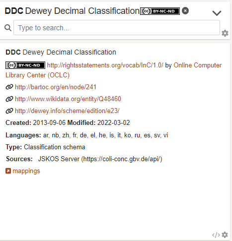

Individual knowledge organization systems are referred to as **concept schemes** or just **schemes**. Concept schemes are also known as ontologies, (controlled) vocabularies, taxonomies, and terminologies. Cocoda provides access to multiple concept schemes from multiple sources.

A concept scheme is an organized collection of [concepts](#concepts) and additional information about the concept scheme.  Cocoda recommends all concept schemes to be registered in the [Basel Register of Thesauri, Ontologies & Classifications (BARTOC)](https://BARTOC.org) and to use its identifiers for to uniquely refer to indivial concept schemes.

To give an example the Dewey Decimal Classification (DDC) is a concept scheme of type universal library classification, published by OCLC and registered in BARTOC with URI <http://bartoc.org/en/node/241>.

### Scheme Details

The details card shows a scheme's or concept's detailed information. In case of a scheme it currently shows the notation, label, license, publisher, and identifier. It will also show a scheme's top concepts if the tree view is minimized. In case of a concept it currently shows a concept's ancestors, its notation and preferred label, notes (scope notes and editorial notes), register entries and additional labels, identifiers, GND terms, and narrower concepts. In most cases, not all of these informations are available for a concept.

